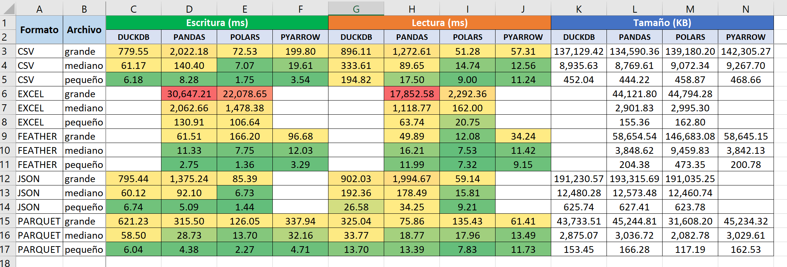

# Data Formats & Engines Benchmark

Este proyecto es una herramienta de evaluación diseñada para medir empíricamente el rendimiento de lectura, escritura y eficiencia de almacenamiento de los formatos de datos más utilizados (CSV, Excel, Parquet, Feather, JSON). 

El benchmark enfrenta a cuatro de los motores analíticos del ecosistema Python: **Pandas**, **Polars**, **DuckDB** y **PyArrow**.

## Objetivo
El objetivo principal es evaluar distintas librerías para reducir los tiempos de ejecución en el procesamiento de datos. Asimismo, esta herramienta está pensada para medir el estado del arte actual: como estas librerías están en constante desarrollo, se recomienda repetir este benchmark ante cada nueva actualización (release) para comprobar si hay mejoras o regresiones de rendimiento.

*Nota: Los resultados de este benchmark son relativos a los recursos del hardware subyacente (CPU, velocidad de disco SSD/HDD y RAM disponible). El código es agnóstico al sistema operativo y compatible con entornos Windows, Linux y macOS.*

## Características Principales
- **Soporte Dinámico de Datos (BYOD):** Permite evaluar cualquier dataset. Al colocar archivos `.xlsx` en la carpeta `data/`, el script los detecta, convierte y procesa automáticamente para todos los formatos.
- **Arquitectura Extensible:** El motor de pruebas utiliza un diccionario de funciones lambda, lo que facilita la integración de nuevas librerías o formatos con mínimos cambios en el código base.
- **Estabilidad de Métricas:** Implementa el cálculo de **Media Acotada (Trimmed Mean)** para filtrar picos de latencia del hardware o del sistema operativo, garantizando resultados estadísticamente representativos.
- **Reportes Automatizados:** Genera un archivo `results_summary.xlsx` para identificar rápidamente la herramienta más veloz por métrica.

## Formatos Evaluados
- **CSV:** Formato estándar de texto plano para intercambio de datos.
- **Excel (.xlsx):** Estándar de ofimática corporativa.
- **Parquet & Feather (IPC):** Formatos columnares binarios, optimizados para compresión y alta velocidad de E/S.
- **JSON:** Formato estructurado estándar para transferencia de datos.

## Instalación y Uso

1. Clonar el repositorio.
2. Instalar las dependencias necesarias:
   pip install -r requirements.txt
3. (Opcional) Generar datos sintéticos de prueba:
   python generator.py
4. (Opcional) Colocar datasets propios (.xlsx) en el directorio data/.
5. Ejecutar el benchmark:
   python benchmark.py

## Notas Técnicas
- **Especialización por Herramienta:** Se evalúa a cada motor únicamente en los formatos donde tiene soporte nativo optimizado (ej. DuckDB y PyArrow no se fuerzan a procesar archivos Excel), asegurando una comparativa justa.
- **Optimización de Exportación:** Se utiliza la instrucción SQL nativa `COPY TO` en DuckDB para maximizar el rendimiento de exportación directa desde C++.
- **Gestión de Contexto:** El script captura y aísla las advertencias de dependencias (como openpyxl o fastexcel) para mantener la salida de la consola limpia y enfocada en el progreso del test.

## Roadmap y Trabajo Futuro
- **Aceleración por GPU:** Evaluación de frameworks como RAPIDS (cuDF) y el motor GPU nativo de Polars ejecutados en entornos Linux para aprovechar la arquitectura CUDA.
- **Compute-Bound Benchmarks:** Transición de métricas estrictamente orientadas a I/O (lectura/escritura en disco) hacia pruebas de transformaciones pesadas en memoria (JOINs masivos, Window Functions, GroupBys) para explotar el verdadero potencial del procesamiento paralelo en placas de video.

- **Escalabilidad Cloud:** Ejecución del pipeline en instancias optimizadas para memoria en la nube para establecer líneas base de rendimiento fuera de entornos locales.
